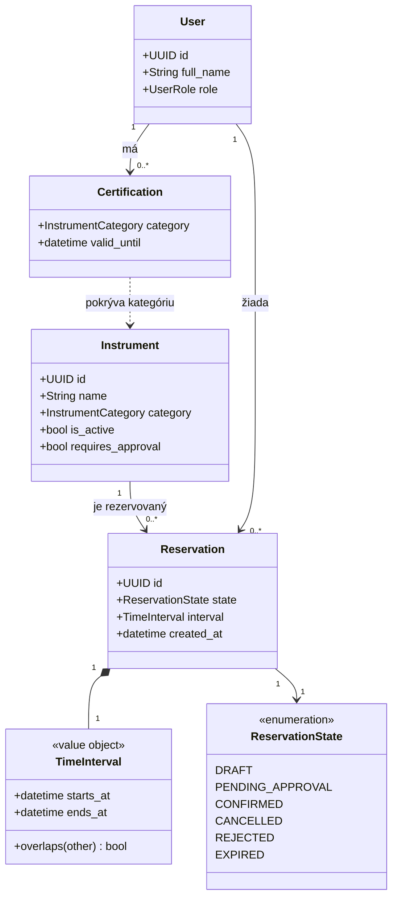
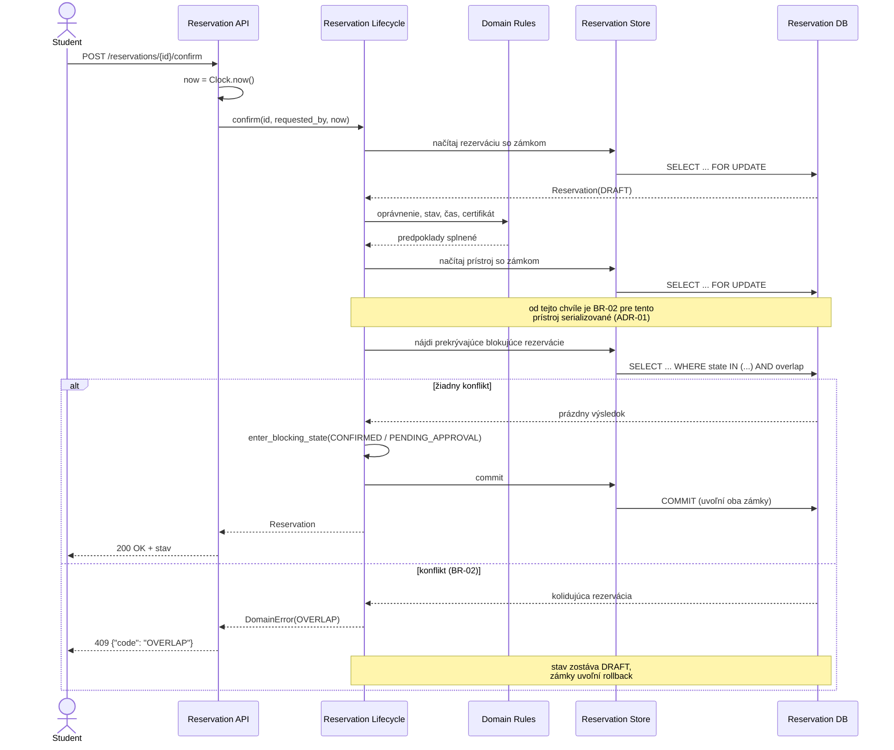
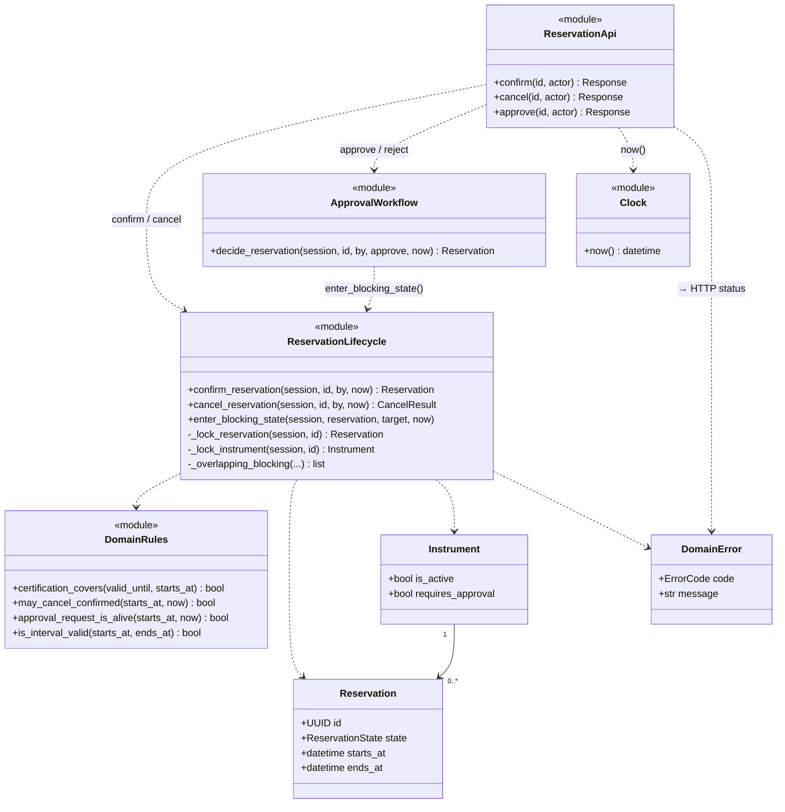

# Architecture and Decisions

## Stack
Python 3.12+ · FastAPI · SQLAlchemy 2.0 · PostgreSQL 16 · pytest

**Zdôvodnenie.** Tím vie Python, takže čas nejde na učenie jazyka ale na návrh
systému. FastAPI dáva HTTP vrstvu s validáciou vstupov bez vlastného kódu na
parsovanie. PostgreSQL je zvolený zámerne a nie je zameniteľný za SQLite:
future pressure, ktorú sme si vybrali (súbežné potvrdzovanie), sa bude riešiť
transakčnou izoláciou a databázovými constraintmi, a tie SQLite v potrebnej
podobe nemá.

## Vrstvy
- `swilab/models.py` — perzistentné entity (SQLAlchemy).
- `swilab/domain/` — stavy a pravidlá; nezávisí na HTTP ani na databáze.
- `swilab/api/` — HTTP endpointy, tenká vrstva nad doménou.
- `swilab/db.py` — engine a session.
- `swilab/config.py` — konfigurácia z prostredia.

Pravidlá zámerne nesedia v entitách. Pri vybranej future pressure očakávame, že
vyhodnotenie prekryvu sa presunie bližšie k databáze (constraint alebo zámok);
ak je pravidlo oddelené, je to zmena na jednom mieste.

## Rozhodnutie: tri stavy, nie štyri
`DRAFT`, `CONFIRMED`, `CANCELLED`.

Zvažovali sme samostatný stav `REJECTED` pre zamietnuté potvrdenie. Zamietli sme
ho: zamietnutie nie je koncový stav rezervácie, ale výsledok pokusu o prechod.
Používateľ si doplní certifikát a potvrdí znova. Stav `REJECTED` by musel mať
cestu späť do `DRAFT` a nepridal by žiadnu informáciu, ktorú by sme nemali
z chybovej odpovede.

**Revidované v baseline v0.2.** Stavov je šesť a `REJECTED` medzi nimi je.
Pôvodné rozhodnutie tým nepadlo — platí presne tak, ako bolo napísané: zamietnuté
*potvrdenie* koncový stav nevyrába a rezervácia zostáva v `DRAFT`. `REJECTED`
v v0.2 znamená niečo iné: **rozhodnutie vedúceho** o žiadosti o schválenie, teda
záznam o konaní človeka, ktorý má zostať viditeľný. Zdôvodnenie je v
[change-impact-c02.md](change-impact-c02.md), rozhodnutie R-4.

## Rozhodnutie: polootvorený interval
Rezervácia pokrýva `[starts_at, ends_at)`. Susediace rezervácie teda nekolidujú.
Bez tohto rozhodnutia každá implementácia prekryvu skončí pri chybe o jedna
a tím sa o nej dozvie až z testu, ktorý niekto napíše opačne.

## Rozhodnutie: časy ako timestamptz
Všetky časy sú timezone-aware a v databáze `timestamptz`. Naive časy sú zdroj
chýb pri prechode na letný čas, a laboratórium rezervuje aj cez koniec marca.
Toto rozhodnutie je zároveň predmetom nášho C01 spiku — overili sme, že
presnosť a timezone prežijú zápis a načítanie.

## Rozhodnutie: spike proti docker-compose, nie testcontainers
Testy čítajú `DATABASE_URL`. Predvolene mieria na Postgres z `docker-compose.yml`
tohto repa, ale rozbehnú sa proti akémukoľvek Postgresu. Testcontainers by boli
pohodlnejšie, ale pribíjajú testy na bežiaci Docker daemon u každého člena tímu.

## Open / neriešené v C01
- Súbežné potvrdzovanie (naša future pressure) — pomenované, neimplementované.
- Notification Service — definovaná hranica, bez implementácie.
- Autentifikácia — mimo rozsah predmetu.

---

# C03 časť A — AS-IS realizácia scenára *Confirm Reservation*

Tento oddiel popisuje, ako **súčasná** implementácia realizuje jeden scenár
z baseline v0.2. Nie je to cieľový návrh.

**Spôsob overenia.** Mapovanie krokov, vetiev a závislostí je overené čítaním
kódu na uvedených riadkoch. Testová sada bola pre tento oddiel spustená proti
čistej databáze z `docker-compose.yml`:

```
86 passed, 3 xfailed in 4.41s
```

Pri review PR #6 zopakované nad rovnakým commitom s rovnakým výsledkom.

Všetky testy menované v stĺpcoch *Doklad* v tomto oddiele sú v tomto behu
zahrnuté a prechádzajú. Tri `xfailed` sú tri testovacie prípady pre **dve**
doložené medzery z A3 — `REQ-05` (dva parametrizované prípady) a `REQ-16`:

```
XFAIL test_concurrent_conflicting_confirmations[False-dve subezne potvrdenia -> najviac jedna CONFIRMED]
XFAIL test_concurrent_conflicting_confirmations[True-dve subezne ziadosti -> najviac jedna PENDING_APPROVAL]
XFAIL test_concurrent_cancel_and_confirm_on_same_reservation
```

Oba prípady `REQ-05` volajú **OP-03 Confirm** — líšia sa iba príznakom
`requires_approval` prístroja, teda vetvou `REQ-10`. Ani jeden nevolá
schválenie (OP-05); súbeh pri schvaľovaní test nemá (viď A3).

Pri `--runxfail` padajú všetky tri na vlastnom asserte (`['OK', 'OK']`), nie na
chybe inštrumentácie — sú to skutočné dôkazy, nie prehltnuté zlyhania.

Sada predpokladá, že PostgreSQL beží s `TimeZone = UTC` (predvolené v obraze
`postgres:16` z `docker-compose.yml`). Proti serveru s iným pásmom padne
`test_persistence_spike.py` na asserte `utcoffset() == 0` — to je zámer spiku
z C01, nie chyba aplikácie.

Riadkové odkazy platia pre kód v commite `ec7ccdc` (`main`). Táto vetva kód
nemení, takže po zlúčení platia ďalej.

## A1. Sledovaný scenár

| Položka | Hodnota |
| ------- | ------- |
| Scenár / operácia | `OP-03 Confirm Reservation` |
| Požiadavky | `REQ-04`, `REQ-05`, `REQ-06`, `REQ-10`, `REQ-16` |
| Pravidlá / invarianty | `BR-01` (prekryv intervalov), `BR-02` (neprekrývanie — invariant), `BR-04` (certifikácia), `BR-05` (neaktívny prístroj), `BR-06` (oprávnenie), `BR-08` (živosť žiadosti) |
| Baseline | `v0.2` |

Zoznam zodpovedá „Odkazu na pravidlá" a požiadavkám pri OP-03 v
`specification.md`; `BR-08` vstupuje cez `REQ-04` (živá žiadosť blokuje).

Zvolili sme `Confirm`, lebo je to prechod, ktorým rezervácia **začne blokovať**
prístroj (`DRAFT → CONFIRMED` alebo `DRAFT → PENDING_APPROVAL`), a teda prvé
miesto, kde sa vyhodnocuje invariant `BR-02`. Od v0.2 už nie jediné — rovnakú
kontrolu znova robí schválenie (OP-05), ako hovorí aj zdôvodnenie OP-03
v špecifikácii. Práve z toho vychádza nález v A5 a otázka v A8.

## A2. Hlavný priebeh scenára namapovaný na kód

| Krok scenára (v0.2) | Realizácia v kóde | Doklad |
| ------------------- | ----------------- | ------ |
| prijať požiadavku o potvrdenie | `api/reservations.py:129` `confirm_reservation()` — endpoint `POST /reservations/{id}/confirm` | `tests/test_api.py::test_http_confirm_reservation` |
| odčítať čas pre pravidlá | `api/reservations.py:136` `now=clock.now()` → `clock.py:4`; služba čas sama neodčítava, dostane ho ako parameter `now` | `git grep "datetime.now" src/swilab/services` → žiadny výskyt |
| načítať `Reservation` | `services/reservations.py:218` `session.get(Reservation, …)` | `test_unknown_reservation_is_rejected` |
| overiť oprávnenie žiadateľa (BR-06) | `services/reservations.py:222` `_require_user()` (žiadateľ musí existovať), `:223` → `_require_authorized()` na `:65` | `test_confirm_by_foreign_student_is_forbidden`, `test_supervisor_confirms_foreign_reservation` |
| overiť, že prechod je povolený (stav `DRAFT`) | `services/reservations.py:225` | `test_confirm_is_not_idempotent`, `test_confirm_of_pending_request_is_rejected` |
| overiť, že rezervácia ešte nezačala (REQ-06) | `services/reservations.py:230` | `test_confirm_after_start_is_rejected` |
| overiť, že prístroj je aktívny (BR-05) | `services/reservations.py:236–237` | `test_confirm_rejects_inactive_instrument` |
| overiť certifikát vlastníka (BR-04) | `services/reservations.py:243–253` (dotaz `:243–248`, rozhodnutie `:249`), predikát `domain/rules.py:34` `certification_covers()` | `test_certification_boundary`, `test_confirm_rejects_wrong_category_certification` |
| vyhodnotiť konflikt (BR-02) | `services/reservations.py:255` → `_overlapping_blocking()` na `:74` (dotaz skladaný v službe) | `test_confirm_rejects_overlap_and_keeps_draft`, `test_confirm_allows_adjacent_interval` |
| zmeniť stav (REQ-10) | `services/reservations.py:272–276` — `CONFIRMED`, alebo `PENDING_APPROVAL` podľa `Instrument.requires_approval` | `test_confirm_allocates_instrument` (`CONFIRMED`), `test_confirm_on_guarded_instrument_creates_request` (`PENDING_APPROVAL`) |
| uložiť výsledok | `services/reservations.py:277` `session.commit()` | tie isté testy |

Certifikát sa overuje **vlastníkovi rezervácie, nie žiadateľovi** — vedúci môže
potvrdiť cudziu rezerváciu, ale nie za niekoho, kto školenie nemá
(komentár `services/reservations.py:240–242`, podmienka `:245`
`Certification.user_id == reservation.user_id`).

## A3. Alternatívna vetva: konflikt → zamietnutie

| Čo hovorí v0.2 | Kde sa podmienka zistí | Kde sa rozhodne výsledok | Čo dostane volajúci |
| -------------- | ---------------------- | ------------------------ | ------------------- |
| `BR-02`/`REQ-04`: prekryv s blokujúcou rezerváciou → potvrdenie zamietnuté, rezervácia **zostáva v `DRAFT`** | `_overlapping_blocking()`, `services/reservations.py:74–106` — podmienka je v SQL `WHERE`, nie v Pythone | `services/reservations.py:263` `if conflicts: raise DomainError(OVERLAP, …)` | HTTP **409** s telom `{"code": "OVERLAP", …}`; preklad robí `main.py` `domain_error_handler()` + `STATUS_BY_CODE` |

Stav zostáva `DRAFT`, lebo zápis `reservation.state` je až za kontrolou
(`:272`) a pred ním sa nič necommituje.

### Rozdiely medzi v0.2 a implementáciou

| Špecifikácia | Implementácia | Doklad |
| ------------ | ------------- | ------ |
| `REQ-05`: pri súbehu smie byť najviac jedna rezervácia v blokujúcom stave | Medzi kontrolou prekryvu (`:255`) a zápisom (`:272–277`) je okno. Dve súbežné potvrdenia prejdú obe. | `tests/test_concurrency_req05.py::test_concurrent_conflicting_confirmations`, `xfail(strict=True)` |
| `REQ-16`: rezervácia opustí stav `DRAFT` najviac raz | Súbežné zrušenie a potvrdenie tej istej rezervácie uspejú obe. | `tests/test_concurrency_req05.py::test_concurrent_cancel_and_confirm_on_same_reservation`, `xfail(strict=True)` |
| OP-03 ani diagram aktivít 3.3 vetvu „neznámy žiadateľ" nepoznajú — po „neznáma rezervácia" nasleduje rovno oprávnenie | `:222` `_require_user()` vráti `UNKNOWN_USER` → HTTP 404 ešte pred kontrolou oprávnenia | iba kód; **test chýba** — `test_unknown_user_is_rejected` pokrýva len OP-01 |

Prvé dva rozdiely sú **vedomé a zdokumentované** — nie sú to prehliadnutia.
`REQ-05` je driver č. 1 prenesený z C02 (`evidence-and-evolution.md`,
„Architektonické drivery prenesené do C03"); `REQ-16` pribudol ako driver po
nezávislej revízii v0.2 (nález N-07, `specification.md` časť 9). Tretí rozdiel
je neošpecifikovaná vetva: správanie je rozumné, ale špecifikácia o ňom mlčí.

Mimo tohto scenára, no s tou istou príčinou: `REQ-05` hovorí aj o súbežnom
**schvaľovaní** a `REQ-16` aj o súbehu zrušenia so schválením. Štrukturálne
rovnaké okno je v `decide_reservation()` (kontrola `:428`, zápis `:442–443`),
ale test, ktorý by ho doložil, neexistuje.

## A4. Hlavné časti implementácie

Päť modulov, všetky na rovnakej úrovni detailu (modul, nie trieda). Každý
súbor z `src/swilab` patrí práve do jedného z nich. `Clock` je malý, ale ako
samostatný blok je zámerne: zdroj času je driver č. 2 prenesený z C02.

| Časť implementácie | Typ / obsah | Rola v tomto scenári | Doklad |
| ------------------ | ----------- | -------------------- | ------ |
| `Reservation API` | *module* — `api/reservations.py`, `main.py` | prijme command, otvorí session pre request, odčíta čas, preloží zamietnutie na HTTP status | `api/reservations.py:22` `SessionDep`, `:124–138`, `main.py` `STATUS_BY_CODE` |
| `Reservation services` | *module* — `services/reservations.py` | rozhoduje o prechode; skladá dotazy a commituje; drží poradie kontrol zhodné s diagramom aktivít | `services/reservations.py:200–278` |
| `Domain rules` | *module* — `domain/rules.py`, `domain/states.py`, `errors.py` | čisté predikáty pravidiel, množina `BLOCKING_STATES`, kódy zamietnutí `ErrorCode` | `domain/rules.py:34`, `domain/states.py:25`, `errors.py` `DomainError` |
| `Persistence model` | *module* — `models.py`, `db.py`, `config.py` | mapovanie na tabuľky, engine a session | `models.py` `Reservation`, `db.py` `get_session()` |
| `Clock` | *module* — `clock.py` | jediný zdroj času pre pravidlá | `clock.py:4` |

Notification integration medzi blokmi **nie je** — v kóde neexistuje (viď A6).

## A5. Stav, zmena stavu a jedno pravidlo

### Stav

| Otázka | Odpoveď | Doklad |
| ------ | ------- | ------ |
| Kde je stav `Reservation` trvale uložený? | PostgreSQL, tabuľka `reservations`, stĺpec `state` ako pomenovaný enum `reservation_state` | `models.py` `Reservation.state`; schéma vzniká cez `Base.metadata.create_all()` v `main.py` `lifespan()` |
| Ktorý kód rozhoduje a vykonáva prechod použitý v scenári? | `services/reservations.py:272–277` — priradenie `reservation.state` a `session.commit()` v tej istej funkcii | `test_confirm_allocates_instrument` |

Prechod **nerobí entita**. `Reservation` je čistý dátový model bez metód;
rozhodnutie aj zápis sú v servisnej funkcii.

### Business pravidlo: BR-02 (neprekrývanie)

| Otázka | Odpoveď | Doklad |
| ------ | ------- | ------ |
| Kde sa zistí podmienka pravidla? | `_overlapping_blocking()`, `services/reservations.py:74–106`. Nerovnosť `starts_at < ends_at AND ends_at > starts_at` je napísaná **v SQL** (`:101–102`), aby sa nenačítaval celý kalendár prístroja; podmienka živosti žiadosti podľa `BR-08` je hneď nad ňou (`:97–100`). | `services/reservations.py:93–106` |
| Kde sa podľa výsledku rozhodne? | Na **dvoch miestach**: `confirm_reservation()` `:263` a `decide_reservation()` `:436` (schválenie žiadosti). | `test_confirm_rejects_overlap_and_keeps_draft`, `tests/test_approval.py::test_approval_rechecks_overlap` |
| Kde sa vykoná výsledná zmena stavu? | `:272–277` pri potvrdení, `:442–443` v `decide_reservation()` pri schválení. | ako vyššie |

**Nález: predikát prekryvu existuje v dvoch formách a jedna z nich je mŕtva.**
`domain/rules.py:23` definuje `intervals_overlap()` ako čistú funkciu. V celom
repozitári ju **nič neimportuje ani nevolá** — overené `git grep intervals_overlap`,
ktorý v kóde vráti presne dva výskyty: definíciu a zmienku v komentári. Komentár na
`services/reservations.py:90–91` pritom tvrdí, že *„testy ju porovnávajú s ňou"*;
taký test neexistuje. Podmienka `BR-02` teda reálne žije **iba v SQL** a jej
dokumentovaný dvojník nie je ničím krytý.

## A6. Relevantné závislosti

| Závislosť | Kde sa napája na kód | Ktorá časť pozná jej technické API | Doklad |
| --------- | -------------------- | ---------------------------------- | ------ |
| **PostgreSQL 16** | `db.py` `create_engine(settings.database_url)`; `get_session()` ako FastAPI dependency | `Persistence model` (mapovanie, PostgreSQL typ `UUID` v `models.py`, engine v `db.py`), **`Reservation services`** — skladá dotazy cez SQLAlchemy (`select(Certification)` `:243–248`, `select(Reservation)` v `_overlapping_blocking()` `:93–106`) a commituje (`:277`), a **`Reservation API`** — otvára session pre request (`api/reservations.py:22`) | `db.py`, `services/reservations.py:93–106`, `docker-compose.yml` |
| **Notification Service** | **nikde — v kóde neexistuje žiadne volanie** | žiadna | hranica definovaná v `specification.md`; v diagrame prípadov užitia prerušovanou čiarou, v aktivite OP-03 ako krok „TBD-03 – neimplementované"; `TBD-03` |
| **IdP / autentifikácia** | **neexistuje** — `user_id` a `requested_by` sa berú z tela requestu a dôveruje sa im | `Reservation API` (`ActorRequest`) | `api/reservations.py:35–39`; `TBD-06` |

Bežné knižnice frameworku (FastAPI, Pydantic) neuvádzame.

Poznámka k prvému riadku: znalosť technického API databázy **nie je sústredená
v jednej vrstve**. Mapovanie drží `Persistence model`, ale dotazy — vrátane
predikátu `BR-02` aj dotazu na certifikáty — skladá servisná vrstva sama, bez
repozitára. O hranici transakcie rozhodujú dve vrstvy: API session otvorí,
služba commituje. Fyzicky však do databázy vedie **jediná cesta**, cez `Session`
a engine z `db.py`; raw SQL ani vlastné pripojenie v kóde nie je.

## A7. AS-IS štrukturálny diagram

```
+----------------------------------- Application code ------------------------------------+
|                                                                                         |
|  [Reservation API]  (module)                                                            |
|  role: prijme confirm command, otvorí session pre request, odčíta čas,                  |
|        preloží DomainError na HTTP status                                               |
|     |          |                     |                                   |              |
|     |          | now()               | confirm_reservation(              | get_session()|
|     |          v                     |   session, id, by, now)           | (Depends),   |
|     |      [Clock] (module)          v                                   | create_all() |
|     |      role: jediný      [Reservation services]  (module)            | pri štarte   |
|     |      zdroj času        role: rozhoduje o prechode DRAFT ->         |              |
|     |                        CONFIRMED / PENDING_APPROVAL;               |              |
|     |                        sama skladá dotazy na DB                    |              |
|     |                           |                    |                   |              |
|     | ErrorCode      certification_covers(),    Session.get(),           |              |
|     | -> HTTP        BLOCKING_STATES,           scalars(select(...)),    |              |
|     | status         raise DomainError          commit()                 |              |
|     v                           v                    v                   v              |
|  +-----------------------------------+    +------------------------------------------+  |
|  | [Domain rules]  (module)          |    | [Persistence model]  (module)            |  |
|  | role: čisté predikáty, stavy,     |<---| role: mapovanie na tabuľky,              |  |
|  |       kódy zamietnutí             |enum| engine, session na request               |  |
|  +-----------------------------------+    +------------------------------------------+  |
|                                                              |                          |
+--------------------------------------------------------------|--------------------------+
                                                               | SQL (SQLAlchemy engine,
                                                               v      psycopg)
                                                   [Reservation DB]  (database, PostgreSQL 16)

   [Notification Service]  (external system) — NENAPOJENÁ, v kóde neexistuje volanie (TBD-03)
```

Obsah blokov:

```
Reservation API:
- api/reservations.py  (endpointy, Pydantic modely)
- main.py              (STATUS_BY_CODE, domain_error_handler)

Reservation services:
- services/reservations.py  (confirm_reservation, _overlapping_blocking, …)

Domain rules:
- domain/rules.py   (certification_covers, …)
- domain/states.py  (ReservationState, BLOCKING_STATES)
- errors.py         (DomainError, ErrorCode)

Persistence model:
- models.py  (Reservation, Instrument, User, Certification)
- db.py      (engine, SessionFactory, get_session)
- config.py  (DATABASE_URL)

Clock:
- clock.py
```

Každá šípka zodpovedá importu a volaniu v kóde:

| Šípka | Doklad |
| ----- | ------ |
| `Reservation API → Clock` | `api/reservations.py:136` `clock.now()` |
| `Reservation API → Reservation services` | `api/reservations.py:132` `service.confirm_reservation(session, …)` |
| `Reservation API → Persistence model` | `api/reservations.py:22` `Depends(get_session)`; `main.py` `lifespan()` → `Base.metadata.create_all(engine)` |
| `Reservation API → Domain rules` | `main.py` `domain_error_handler()` + `STATUS_BY_CODE` nad `ErrorCode` |
| `Reservation services → Domain rules` | `services/reservations.py:18–25` — `certification_covers`, `BLOCKING_STATES`, `DomainError` |
| `Reservation services → Persistence model` | `:218` `session.get()`, `:243` a `:106` `session.scalars(select(…))`, `:277` `session.commit()` |
| `Persistence model → Domain rules` | `models.py:8` — enumy stavov, kategórií a rolí; importná závislosť, nie volanie |
| `Persistence model → Reservation DB` | `db.py` `create_engine()`, ovládač `psycopg` |

Do databázy vedie **jedna** šípka. Zvláštne na kóde nie je druhá cesta do DB
(neexistuje), ale to, *kto* skladá dotazy: `Reservation services` pracuje so
`Session` priamo, bez repozitára, takže predikát `BR-02` aj dotaz na
certifikáty sú napísané v servisnej vrstve (viď A6). `Reservation services`
nepozná `db.py` — session dostane ako parameter od API.

## A8. Otázka pre ďalší krok C03

| Položka | Obsah |
| ------- | ----- |
| **Otázka** | Kde má byť vynútený invariant `BR-02`, keď o ňom dnes rozhodujú dve operácie — každá s vlastnou kontrolou a vlastným zápisom — a jeho predikát existuje v dvoch formách, z ktorých jedna je mŕtvy kód? |
| **Doklad** | `_overlapping_blocking()` (`services/reservations.py:74`) je volaný z `confirm_reservation()` `:255` (zápis `:272–277`) aj z `decide_reservation()` `:428` (zápis `:442–443`). Podmienka je napísaná v SQL. Paralelná čistá funkcia `rules.intervals_overlap()` (`domain/rules.py:23`) nie je v kóde nikde volaná ani testovaná, hoci komentár na `services/reservations.py:90–91` tvrdí opak. |
| **Prečo je dôležitá** | `BR-02` je jediný invariant systému nad viacerými záznamami (`specification.md`, BR-02). Vo v0.1 ho vynucovalo jedno miesto, vo v0.2 už dve — pridanie ďalšieho blokujúceho stavu alebo ďalšej operácie ho rozšíri znova, a každé miesto musí pamätať aj na podmienku živosti žiadosti (`BR-08`). Zároveň je to tá istá hranica, na ktorej zlyháva `REQ-05`: kontrola a zápis nie sú atomické. Rozhodnutie, *kam* invariant patrí — do servisnej vrstvy, do jedného doménového predikátu, alebo do databázového constraintu — určí, či sa `REQ-05` dá vôbec uzavrieť bez toho, aby sa oprava musela urobiť dvakrát. |

---

# C03 — Architektúra

Nadväzuje na časť A (AS-IS mapovanie scenára `Confirm Reservation`).
Baseline správania zostáva **v0.2**; táto časť nemení špecifikáciu, mení
*štruktúru* implementácie a dopĺňa rozhodnutie, ktoré v nej doteraz chýbalo.

## B. Architektonické drivery

Štyri drivery. Prvé dva sú prenesené z C02 a doložené padajúcimi testami,
tretí vznikol zmenou v0.2, štvrtý je dôsledok tej istej zmeny.

| Podklad / zdroj | Prečo ovplyvňuje architektúru | Otázka, ktorú musí architektúra vyriešiť |
| --------------- | ----------------------------- | ---------------------------------------- |
| **D-1** · `BR-02`, `REQ-04`, `REQ-05`; časť A A3/A5 | Kontrola prekryvu a zápis stavu sú dva kroky bez spoločnej ochrany. Dve súbežné potvrdenia oba prečítajú „bez konfliktu" a oba zapíšu. Navyše o invariante rozhodujú **dve** operácie — `confirm` aj `approve` — každá s vlastnou kópiou postupu. | Kde sa má urobiť autoritatívne rozhodnutie o potvrdení, aby `BR-02` platilo aj pri súbehu, a kto ten invariant vlastní? |
| **D-2** · `REQ-16`, nález N-07 (revízia v0.2); časť A A3 | To isté okno, ale nad **jednou** rezerváciou: medzi kontrolou zdrojového stavu a zápisom. Týka sa aj zrušenia, kde `REQ-05` nefiguruje. Pozorovateľný dôsledok: používateľ dostane na zrušenie úspech a rezervácia pritom blokuje prístroj. | Kto zaručí, že rezervácia opustí daný stav najviac raz, aj keď o ňu súperia dve rôzne operácie? |
| **D-3** · zmena v0.2 (schvaľovanie), `BR-08`, `TBD-08` | Žiadosť žije ďalej po skončení requestu, ktorý ju vytvoril. `EXPIRED` sa dnes zapíše len vtedy, keď na záznam niekto siahne — zabudnutá žiadosť ticho blokuje prístroj až do `starts_at`. | Kto vlastní stav čakajúcej žiadosti a kto vykoná neskorší prechod, keď ho nevyvolá žiadny používateľ? |
| **D-4** · `TBD-03`, `TBD-09`; časť A A6 | Notification Service nie je v kóde napojená a systém nemá **žiadnu** čítaciu operáciu. Vedúci sa o žiadosti nedozvie a žiadateľ sa nedozvie výsledok. Business zmena sa pritom uloží skôr, než by sa správa odoslala. | Kde má byť integrácia izolovaná a má jej zlyhanie zmeniť výsledok potvrdenia? |

Žiadny z driverov nepomenúva riešenie. `transakcia`, `zámok`, `constraint`,
`worker` sú kandidáti na mechanizmus, nie drivery.

## C1. Doménový model



Invariant pri vzťahu `Instrument → Reservation`:

> Pre jeden `Instrument` sa nesmú prekrývať `TimeInterval`-y dvoch rezervácií
> v **blokujúcom** stave (`CONFIRMED`, alebo živá `PENDING_APPROVAL` podľa
> `BR-08`). — `BR-02`

`TimeInterval` je v modeli ako value object zámerne: `BR-01` je vlastnosť
intervalu, nie rezervácie. V dnešnom kóde sú to dva stĺpce — rozdiel je
zaznamenaný v delte (J) ako `KEEP`, lebo pre rozhodnutie z ADR-01 nemá dôsledok.

Model neobsahuje `Controller`, `Repository` ani frameworkové triedy.

## C2. Odpovednosti systému

| Zdroj | Odpovednosť | Čo musí rozhodovať / vlastniť | Jeden jasný vlastník? | Dôvod |
| ----- | ----------- | ----------------------------- | --------------------- | ----- |
| **O-1** · OP-03 + statechart | rozhodnúť, či je prechod rezervácie povolený | životný cyklus jednej rezervácie | **áno** | dve operácie nesmú o tom istom zdrojovom stave rozhodnúť rozdielne (`D-2`) |
| **O-2** · `BR-02`, `REQ-05` | vyhodnotiť konflikt a zachovať invariant | rozhodnutie o vstupe do blokujúceho stavu | **áno** | súbeh nesmie porušiť invariant; dnes o ňom rozhodujú dve miesta (`D-1`) |
| **O-3** · `BR-04`, `BR-05`, `BR-06`, `BR-07` | overiť predpoklady operácie | predikáty pravidiel | nie | sú to čisté funkcie bez stavu; smie ich volať ktokoľvek |
| **O-4** · OP-02 | odpovedať na dostupnosť | nič — len číta | nie | čítacia operácia, výsledok nič nealokuje |
| **O-5** · zmena v0.2 | spravovať čakajúcu žiadosť | `PENDING_APPROVAL`, `REJECTED`, `EXPIRED` | **áno** | stav prežije request, ktorý ho vytvoril (`D-3`) |
| **O-6** · `BR-03`, `BR-08` | poskytnúť čas pravidlám | jediný zdroj „teraz" | **áno** | dve pravidlá v jednej operácii musia vidieť ten istý okamih |
| **O-7** · `TBD-03` | doručiť notifikáciu | doručenie a opakovanie | podľa návrhu | externé zlyhanie musí mať definovaný význam (`D-4`) |
| **O-8** · perzistencia | uložiť a načítať stav | mapovanie na tabuľky, hranica transakcie | **áno** | bez jasnej hranice transakcie nemá `O-2` čo chrániť |

Zoskupenie a oddelenie:

- **O-1 a O-2 musia byť spolu.** Zdieľajú ten istý zápis. Keby rozhodnutie
  o prekryve robilo iné miesto než zápis stavu, vznikne medzi nimi okno —
  presne to, čo dokladajú `REQ-05` a `REQ-16`.
- **O-5 má byť oddelené od O-1 v zodpovednosti, nie v zápise.** Schvaľovanie má
  vlastný dôvod na zmenu (politika vedúceho, expirácia), ale výsledný prechod
  do blokujúceho stavu musí prejsť cez vlastníka `O-2`. Inak má invariant dvoch
  vlastníkov, čo je dnešný stav.
- **O-7 má byť oddelené od všetkého ostatného.** Iná technológia, iná
  dôveryhodnostná hranica, iný režim zlyhania.
- **O-3 a O-6 nesmú poznať perzistenciu.** Sú to čisté funkcie; práve preto sa
  dajú hranice (`60:00`, `valid_until == starts_at`) testovať bez databázy.

Názvy komponentov tu zámerne nie sú — tie prichádzajú až v G2.

## D. Hlavná rozhodovacia otázka

```
Rozhodovacia otázka:
Kde sa má vynucovať invariant BR-02, aby platil aj pri súbežnom potvrdzovaní
a schvaľovaní — a kto ho vlastní, keď dnes o ňom rozhodujú dve nezávislé
operácie?
```

Vychádza z `D-1`, pokračuje otázkou A8 z časti A a má dôsledok na štruktúru
(kto vlastní), na interakciu (kadiaľ musí prechod prejsť) aj na runtime
(kde vzniká serializácia).

## E1. Dve alternatívy

**Alternatíva A — jeden vlastník invariantu v aplikácii, serializácia zámkom**

```
+---------------------- Reservation Application -----------------------+
|                                                                      |
|  [Confirm]        [Approve]                                          |
|      \               /                                               |
|       v             v                                                |
|   [Reservation Lifecycle]   <- JEDINÝ vlastník BR-02                 |
|    enter_blocking_state():                                           |
|      lock(Instrument) -> check overlap -> write state                |
+----------------------------------|-----------------------------------+
                                   | SELECT ... FOR UPDATE
                                   v
                          [Reservation DB]
```

**Alternatíva B — invariant vynútený databázou**

```
+---------------------- Reservation Application -----------------------+
|  [Confirm]        [Approve]                                          |
|      \               /                                               |
|       v             v                                                |
|   [Reservation Lifecycle]  -> zapíše a zachytí porušenie             |
+----------------------------------|-----------------------------------+
                                   | INSERT/UPDATE
                                   v
                          [Reservation DB]
                EXCLUDE USING gist (instrument_id WITH =,
                       tstzrange(starts_at, ends_at) WITH &&)
                WHERE state IN ('CONFIRMED','PENDING_APPROVAL')
```

## E2. Porovnanie voči driverom

| Driver / kritérium | Alternatíva A (zámok v službe) | Alternatíva B (DB constraint) |
| ------------------ | ------------------------------ | ----------------------------- |
| **D-1** konzistencia `BR-02` | Platí, kým každá cesta zámok vezme. Vynútiteľné testom nad kódom, nie databázou. | Platí vždy, aj pri zápise mimo aplikácie (migrácia, `psql`, iná služba). Silnejšie. |
| **D-3** živosť žiadosti (`BR-08`) | Podmienka „žiadosť je živá, kým nenastal `starts_at`" sa vyhodnotí v SQL dotaze s aktuálnym časom. Žiadny problém. | **Nedá sa vyjadriť.** Index ani constraint nesmie volať `now()` — nie je immutable. Constraint by blokoval aj vypršané žiadosti, takže `EXPIRED` by sa musel zapisovať dávkovo. Vynúti si vyriešiť `TBD-08` v tom istom kroku. |
| **D-2** stratený zápis nad jednou rezerváciou | Rieši ten istý mechanizmus — zámok nad riadkom rezervácie. Jedno rozhodnutie pokryje oba drivery. | **Nerieši vôbec.** Constraint hovorí o prekryve dvoch záznamov, nie o dvoch zápisoch do jedného. `REQ-16` by zostal otvorený. |
| **zmena / ownership** | Invariant je v kóde, čitateľný a testovateľný. Riziko: ďalšia operácia zámok „zabudne" — preto kontrola v L2. | Invariant je v schéme. Riziko: nie je vidieť pri čítaní kódu a chyba sa prejaví až ako `IntegrityError`, ktorý treba preložiť na `OVERLAP`. |
| **prevádzková zložitosť** | Žiadna nová závislosť. Zámok nad riadkom prístroja serializuje potvrdenia **pre ten istý prístroj**; rôzne prístroje bežia súbežne ďalej. | Vyžaduje rozšírenie `btree_gist` a migráciu. Migrácie zatiaľ nemáme (`create_all` pri štarte), takže by to bolo druhé architektonické rozhodnutie v tom istom kroku. |

## E3. Ten istý scenár cez obe alternatívy

Scenár: `Confirm Reservation` pre prístroj so schvaľovaním.
Komplikácia: **dve súbežné potvrdenia prekrývajúcich sa intervalov.**

| Krok / udalosť | Alternatíva A | Alternatíva B |
| -------------- | ------------- | ------------- |
| `Confirm` začne (dve vlákna naraz) | obe prejdú kontrolou oprávnenia, stavu, certifikátu | rovnako |
| vstup do kritickej sekcie | prvé vlákno vezme zámok nad riadkom prístroja, druhé čaká | žiadna kritická sekcia; obe pokračujú |
| vyhodnotenie prekryvu | prvé nevidí konflikt a zapíše `PENDING_APPROVAL`; druhé po uvoľnení zámku dotaz **zopakuje** a konflikt už vidí | obe nevidia konflikt a obe zapíšu |
| request skončí | prvé `201`/`200`, druhé `409 OVERLAP` | prvé uspeje, druhé dostane `IntegrityError` z databázy |
| volajúci dostane | definovaný business kód `OVERLAP` | technickú chybu, ktorú treba preložiť na `OVERLAP` — inak unikne `500` |
| schválenie príde neskôr | prechod `PENDING_APPROVAL → CONFIRMED` ide cez toho istého vlastníka a znova pod zámkom | constraint drží, ale medzitým vypršaná žiadosť stále blokuje (`BR-08` sa nedá vyjadriť) |
| výsledok invariantu | najviac jedna blokujúca rezervácia | najviac jedna blokujúca rezervácia, ale aj vypršané žiadosti blokujú |

Obe alternatívy požadované správanie **realizovať vedia**. Líšia sa v tom, čo
pritom rozbijú: B rieši `D-1` silnejšie, ale nerieši `D-2` a rozbíja `D-3`.

## F. ADR-01

```
## ADR-01 — Kde sa vynucuje invariant BR-02

Kontext:
  Baseline v0.2 má jediný invariant nad viacerými záznamami: dve blokujúce
  rezervácie toho istého prístroja sa nesmú prekrývať (BR-02). Vo v0.1 o ňom
  rozhodovalo jedno miesto, vo v0.2 dve — confirm aj approve, každé s vlastnou
  kontrolou a vlastným zápisom. Medzi kontrolou a zápisom je okno; doložené
  padajúcimi testami REQ-05 a REQ-16 (časť A, A3). Predikát prekryvu navyše
  existoval v dvoch formách a jedna z nich bola mŕtvy kód.

Drivery:
  D-1 (BR-02 pri súbehu), D-2 (stratený zápis nad jednou rezerváciou),
  D-3 (živosť žiadosti podľa BR-08).

Alternatíva A:
  Jediný vlastník invariantu v aplikácii. Všetky prechody do blokujúceho stavu
  idú cez enter_blocking_state(); kritickú sekciu serializuje zámok nad riadkom
  prístroja (SELECT ... FOR UPDATE), prechod nad jednou rezerváciou zámok nad
  jej riadkom.

Alternatíva B:
  Invariant vynútený databázou — EXCLUDE constraint cez btree_gist nad
  (instrument_id, tstzrange(starts_at, ends_at)) pre blokujúce stavy.

Rozhodnutie:
  Prijímame alternatívu A.

Dôvod:
  Jedno rozhodnutie zatvára D-1 aj D-2 tým istým mechanizmom. Alternatíva B
  rieši D-1 silnejšie, ale D-2 nerieši vôbec — constraint hovorí o vzťahu dvoch
  záznamov, nie o dvoch zápisoch do jedného. A rozbíja D-3: podmienka živosti
  žiadosti závisí od aktuálneho času a constraint ani index now() volať nesmie,
  takže by blokovali aj vypršané žiadosti. B by si vynútila vyriešiť TBD-08
  (dávkový zápis EXPIRED) a zaviesť migrácie v tom istom kroku — dve ďalšie
  rozhodnutia, na ktoré zatiaľ nemáme podklad.

Prijaté negatívne dôsledky:
  1. Invariant drží dohoda v kóde, nie schéma. Zápis mimo aplikácie — migrácia,
     psql, budúca druhá služba — ho poruší a databáza to nezachytí.
  2. Zámok nad riadkom prístroja serializuje VŠETKY potvrdenia a schválenia pre
     ten istý prístroj. Pri desaťnásobku súbežných rezervácií (future pressure
     z C01) to je bod, ktorý treba merať.
  3. Správnosť závisí od toho, že žiadna budúca operácia zámok neobíde. Preto
     je súčasťou rozhodnutia automatická kontrola (L2), nie len code review.
  4. Odstránili sme rules.intervals_overlap(). Prekryv sa dá odteraz testovať
     iba proti databáze, nie ako čistá funkcia.

Rozhodnutie znovu otvoríme, keď:
  - meranie ukáže, že serializácia na prístroj je úzke hrdlo; alebo
  - pribudne druhý zapisovateľ do tej istej databázy (druhá služba, import,
    dávka), lebo vtedy dohoda v kóde prestane stačiť; alebo
  - vyriešime TBD-08 tak, že EXPIRED sa zapisuje dávkovo — vtedy prestane
    platiť hlavná námietka proti alternatíve B a constraint sa stane
    realizovateľným doplnkom, nie náhradou.
```

## G1. Kontext systému

```
            [Študent]                      [Vedúci laboratória]
                |                                   |
                | create / confirm / cancel         | approve / reject
                v                                   v
          +-------------------------------------------------+
          |              Reservation System                  |
          +-------------------------------------------------+
                |                                   |
                | uloženie a čítanie stavu          | notification request
                v                                   v
          [Reservation DB]                 [Notification Service]
          (PostgreSQL 16)                  NENAPOJENÁ — TBD-03

                       [IdP] — NEEXISTUJE, identite v požiadavke
                              sa dôveruje (TBD-06)
```

Dve hranice sú nakreslené ako nenapojené zámerne: v kóde pre ne nie je žiadne
volanie (časť A, A6). Kresliť ich ako funkčné by bolo tvrdenie bez dokladu.

## G2. TO-BE statická architektúra

```
+------------------------- Reservation System --------------------------+
|                                                                       |
|  [Reservation API]                                                    |
|  role: prijme command, otvorí session, odčíta čas, preloží chybu      |
|      |                 |                    |                         |
|      | confirm/cancel  | approve/reject     | check availability      |
|      v                 v                    v                         |
|  +---------------------------------+   [Availability Query]           |
|  | [Reservation Lifecycle]         |   role: reportuje BR-02,         |
|  | role: rozhoduje o prechodoch    |         nemení stav              |
|  | owns: Reservation lifecycle     |          |                       |
|  | owns: invariant BR-02           |<---------+ (iba číta)            |
|  +---------------------------------+                                  |
|      ^                 |                                              |
|      | žiada prechod   | vyhodnocuje pravidlá                         |
|      |                 v                                              |
|  [Approval Workflow]   [Domain Rules]        [Clock]                  |
|  role: politika        role: čisté           role: jediný             |
|        schvaľovania          predikáty             zdroj času         |
|  owns: PENDING_APPROVAL,                     owns: "teraz"            |
|        REJECTED, EXPIRED                                              |
|      |                 |                                              |
|      +--------+--------+                                              |
|               v                                                       |
|        [Reservation Store]                                            |
|        role: mapovanie, session, hranica transakcie                   |
|        owns: schéma a zámky                                           |
|                                                                       |
|        [Notification Integration]  — PLÁNOVANÉ, TBD-03                |
+---------------|-----------------------------|-------------------------+
                | SQL + SELECT ... FOR UPDATE  | (zatiaľ žiadne volanie)
                v                              v
        [Reservation DB]                [Notification Service]
```

**Rozhodnutie z ADR-01 je v diagrame viditeľné takto:** `Reservation Lifecycle`
je jediný prvok s `owns: invariant BR-02`. `Approval Workflow` vlastní stav
žiadosti, ale prechod do blokujúceho stavu si od `Reservation Lifecycle`
**žiada** — šípka smeruje k nemu, nie od neho do úložiska. `Availability Query`
`BR-02` iba reportuje a nič nevlastní.

Priradenie odpovedností z C2:

| Odpovednosť | Vlastník |
| ----------- | -------- |
| O-1 prechody rezervácie | Reservation Lifecycle |
| O-2 invariant `BR-02` | Reservation Lifecycle |
| O-3 predikáty pravidiel | Domain Rules |
| O-4 dostupnosť | Availability Query |
| O-5 stav žiadosti | Approval Workflow |
| O-6 zdroj času | Clock |
| O-7 notifikácia | Notification Integration *(plánované)* |
| O-8 perzistencia a transakcia | Reservation Store |

## G3. Vlastníctvo prechodov v statecharte

| Prechod | Owner rozhodnutia | Kto smie prechod iba vyžiadať |
| ------- | ----------------- | ----------------------------- |
| `DRAFT → CONFIRMED` | Reservation Lifecycle | Reservation API (na podnet študenta alebo vedúceho) |
| `DRAFT → PENDING_APPROVAL` | Reservation Lifecycle | Reservation API; o tom, že sa ide touto vetvou, rozhoduje `Instrument.requires_approval` (`REQ-10`) |
| `PENDING_APPROVAL → CONFIRMED` | **Reservation Lifecycle** (vstup do blokujúceho stavu) | **Approval Workflow** po kladnom rozhodnutí vedúceho |
| `PENDING_APPROVAL → REJECTED` | Approval Workflow | Reservation API (vedúci) |
| `PENDING_APPROVAL → EXPIRED` | Approval Workflow | nikto — vyvolá ho plynutie času (`BR-08`), zapíše najbližšia operácia, ktorá záznam číta (`TBD-08`) |
| `DRAFT → CANCELLED`, `CONFIRMED → CANCELLED`, `PENDING_APPROVAL → CANCELLED` | Reservation Lifecycle | Reservation API (vlastník alebo vedúci) |

Rozdiel medzi tretím a štvrtým riadkom je celý obsah ADR-01. Zamietnutie je
koncový stav, ktorý nič nealokuje, preto ho `Approval Workflow` rozhodne sám.
Schválenie **alokuje prístroj**, takže ho musí vykonať vlastník invariantu.

## G4. Runtime / deployment

```
[Reservation Application — jeden proces, uvicorn]
obsahuje:
  - Reservation API
  - Reservation Lifecycle      <- vlastník BR-02
  - Approval Workflow
  - Availability Query
  - Domain Rules
  - Clock
  - Reservation Store

        | SQL, SELECT ... FOR UPDATE
        v
  [PostgreSQL 16 — kontajner db z docker-compose.yml, port 5433]

  [Notification Service]  - plánované, žiadne volanie (TBD-03)
  [IdP]                   - neexistuje (TBD-06)
```

Jeden proces, jedna databáza. **Serializácia z ADR-01 nevzniká v procese, ale
v databáze** — preto rozhodnutie platí aj vtedy, keď procesov bude viac.
Keby bol zámok v pamäti procesu, druhá inštancia aplikácie by ho obišla.

## H1. Návrhový sekvenčný diagram — Confirm Reservation



Pri schvaľovaní je sekvencia rovnaká s tým rozdielom, že volajúcim je
`Approval Workflow` a nie API — prechod do blokujúceho stavu ide cez ten istý
`enter_blocking_state()`.

## H2. Návrhový triedny diagram



Každá lifeline z H1 má tu štrukturálneho vlastníka. `enter_blocking_state()` je
jediná operácia, ktorá priraďuje blokujúci stav — a `ApprovalWorkflow` k nej
vedie závislosť, nie vlastný zápis.

## I. Cross-view kontrola

| Kontrola | Výsledok |
| -------- | -------- |
| C02 ↔ G2 | **OK.** Všetkých päť operácií má v G2 vlastníka; `BR-01`–`BR-08` sú pokryté `Domain Rules` a `Reservation Lifecycle`. |
| C2 ↔ G2 | **OK po oprave.** Prvý návrh dával `Approval Workflow` vlastníctvo prechodu `PENDING_APPROVAL → CONFIRMED`, čím by invariant mal dvoch vlastníkov — presne to, čo ADR-01 ruší. Opravené v G2 aj G3: Approval Workflow prechod *žiada*. |
| G2 ↔ H1 | **OK.** Sekvencia používa iba závislosti z G2. `Reservation Lifecycle` nevolá `Reservation API` späť. |
| H1 ↔ H2 | **OK.** Každá správa z H1 má v H2 operáciu na nejakej triede/module. |
| statechart ↔ G3/H1 | **OK po oprave.** Statechart v `diagrams.md` nerozlišuje, kto prechod rozhoduje a kto žiada — G3 to dopĺňa, statechart sa nemení (baseline v0.2 zostáva). |
| G2 ↔ G4 | **OK.** Sedem logických prvkov beží v jednom procese; `Notification Integration` nie je ani v jednom, lebo neexistuje. |
| ADR ↔ G2/G4 | **OK.** `owns: invariant BR-02` je v G2 práve raz; v G4 je vidieť, že serializácia vzniká v databáze, nie v procese. |

Dva rozpory nájdené pri tejto kontrole sú opravené **v diagramoch, pred zmenou
kódu** — nie v kóde.

## J. AS-IS → TO-BE delta

| Oblasť | AS-IS (časť A) | TO-BE (G2/H2) | Akcia |
| ------ | --------------- | ------------- | ----- |
| rozhodnutie o `BR-02` | dve miesta: `confirm_reservation():263` a `decide_reservation():436` | jedno: `enter_blocking_state()` | `CHANGE` |
| kritická sekcia | žiadna — kontrola a zápis bez ochrany | zámok nad riadkom prístroja pred kontrolou prekryvu | `CHANGE` |
| prechod nad jednou rezerváciou | `session.get()` bez zámku, `REQ-16` otvorený | `_lock_reservation()` vo všetkých troch meniacich operáciách | `CHANGE` |
| predikát prekryvu | dve formy, `rules.intervals_overlap()` mŕtva a komentár o nej klamal | jedna forma v SQL | `CHANGE` |
| testy súbehu | `xfail(strict=True)`, bariéra vnútri kritickej sekcie | bariéra na vstupe operácie, bez `xfail` | `CHANGE` |
| ochrana vlastníctva invariantu | žiadna | opakovateľná statická kontrola | `CHANGE` |
| `Reservation` ako dátový model bez metód | prechod robí servisná funkcia | rovnako — vlastník je modul, nie entita | `KEEP` |
| `TimeInterval` ako value object | dva stĺpce `starts_at`, `ends_at` | v doménovom modeli value object | `KEEP` |
| čas ako závislosť | `clock.now()` v API, odovzdáva sa službám | rovnako | `KEEP` |
| perzistencia | jedna cesta do DB cez `Session`/engine | rovnako | `KEEP` |
| smer závislostí | neoverený | `Approval Workflow → Reservation Lifecycle`, nikdy opačne | `VERIFY` |

Notifikácie (`D-4`, `TBD-03`) a dávkové dočisťovanie `EXPIRED` (`D-3`,
`TBD-08`) v tejto delte **nie sú**. ADR-01 ich nerieši a implementovať ich bez
rozhodnutia by bolo presne to, pred čím varuje sekcia K zadania.
