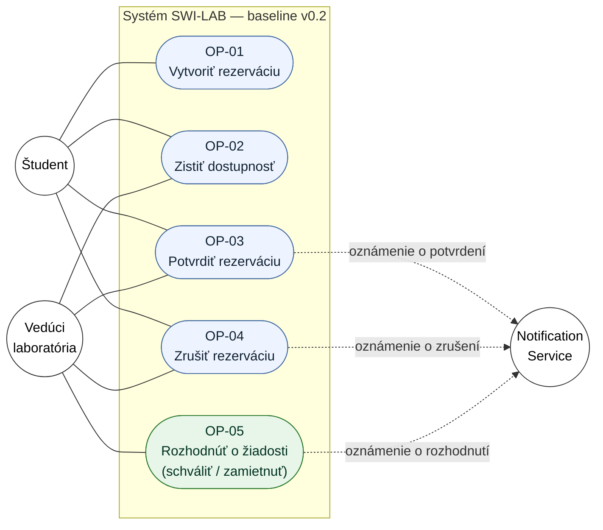
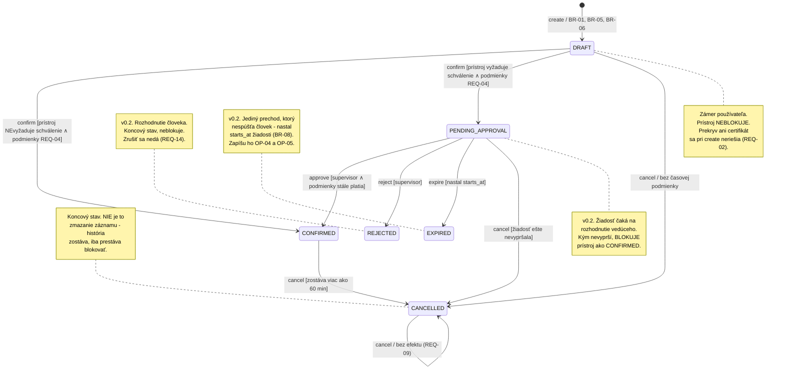
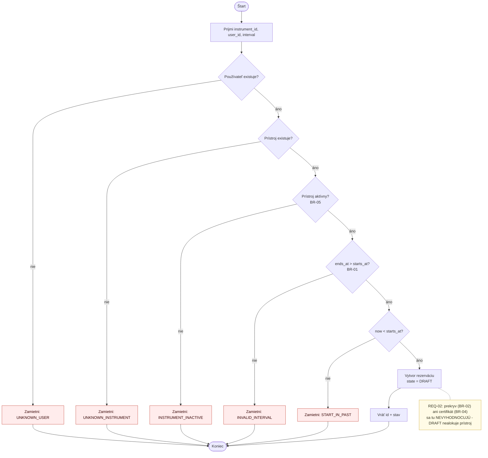
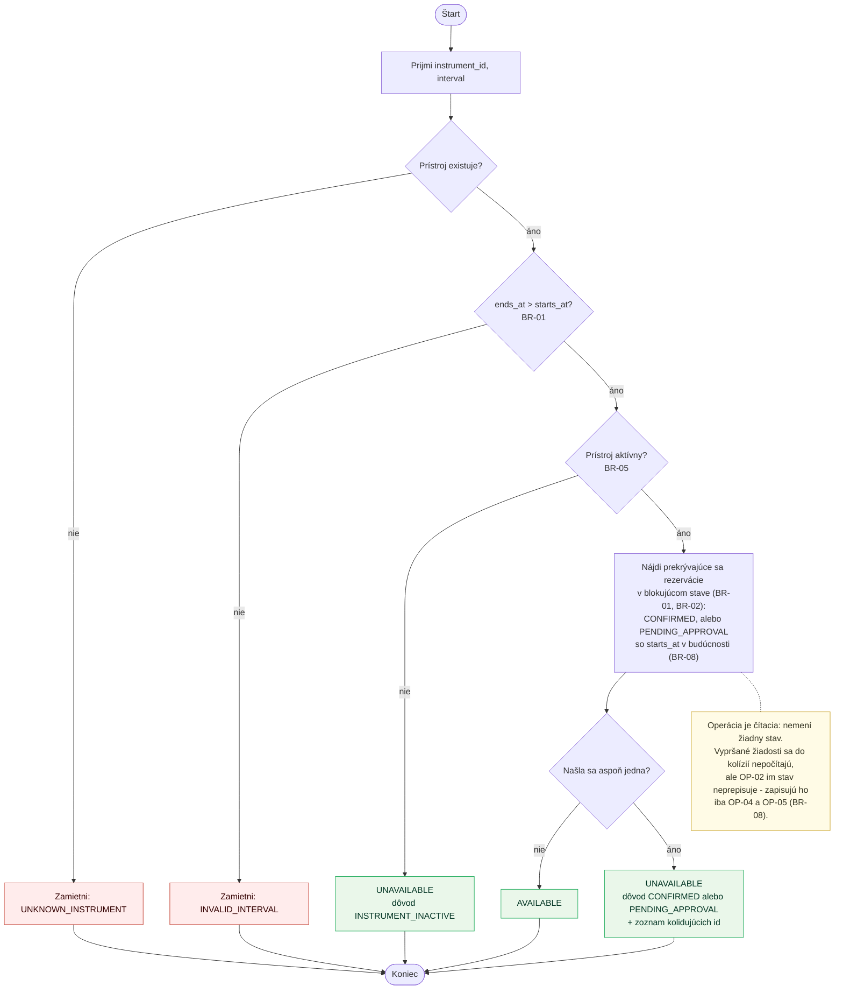
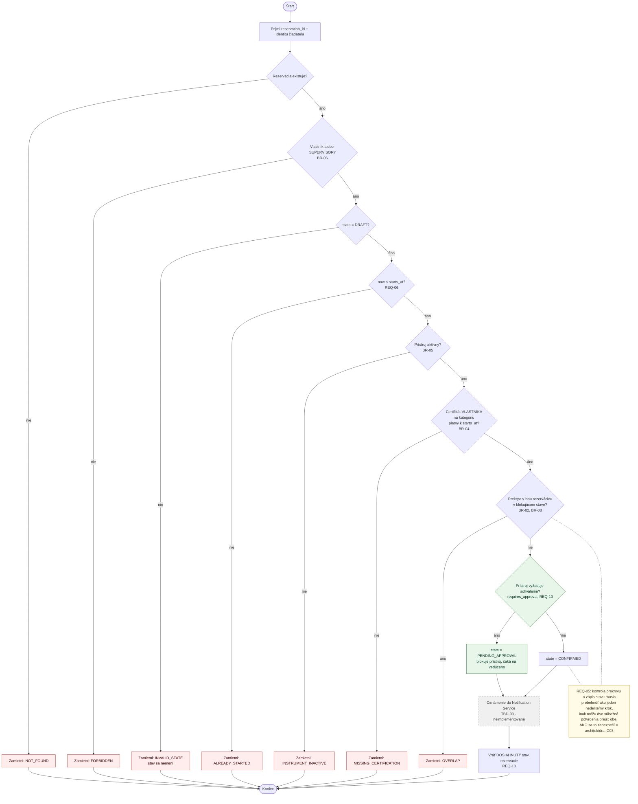
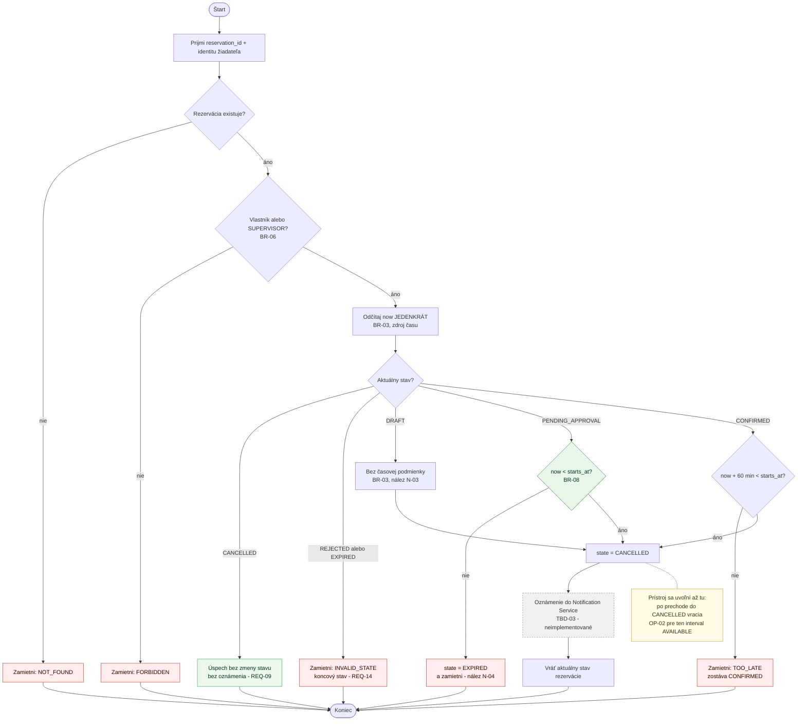
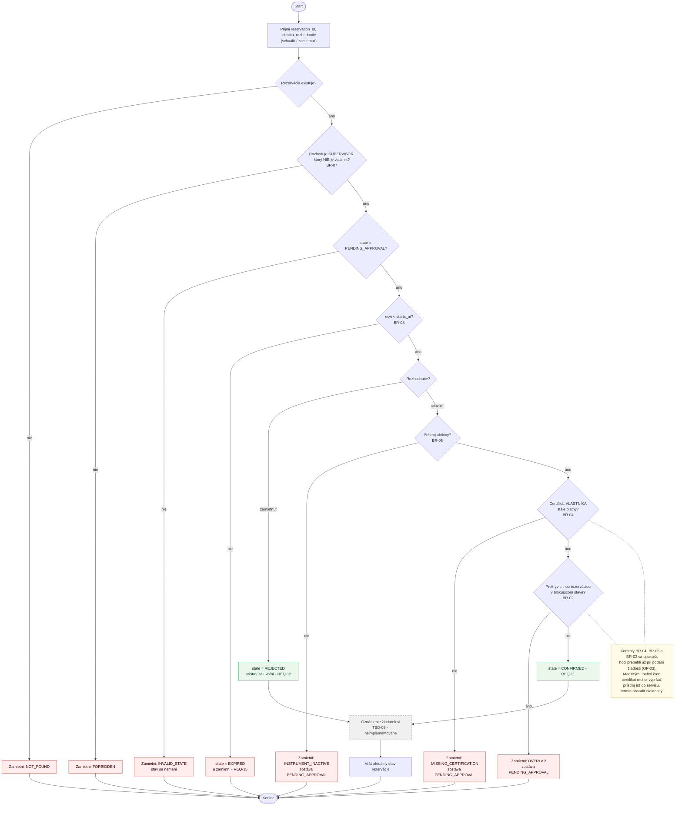

# Diagramy — Specification Baseline v0.2

Vizuálne pohľady na to isté správanie, ktoré popisuje
[docs/specification.md](specification.md). Diagramy **nedopĺňajú** nové pravidlá:
každá podmienka v nich má zodpovedajúce `BR-xx` alebo `REQ-xx` v texte. Ak sa
niekedy rozídu, rozpor sa rieši opravou oboch, nie prekreslením obrázka.

Prvky pridané zmenou v0.2 (schvaľovací proces) sú v texte pod diagramami
označené *(v0.2)*.

---

## 1. Diagram prípadov užitia — aktéri a ciele

Pohľad na celý minimálny systém: kto ho používa a za akým cieľom.

**Čo diagram hovorí a čo nie:**

- **Hranica systému** je obdĺžnik `SYS`. Vnútri sú iba ciele aktérov, nie
  databáza, triedy ani komponenty.
- **Študent** má všetky štyri ciele, ale podľa BR-06 vždy nad **vlastnou**
  rezerváciou.
- **Vedúci laboratória** má tie isté ciele nad **ľubovoľnou** rezerváciou
  (BR-06). Nevytvára rezervácie za iných — preto k `OP-01` nevedie čiara; ak by
  si rezervoval prístroj pre seba, vystupuje v role študenta.
- **OP-05 je jediný cieľ, ktorý patrí výhradne vedúcemu** *(v0.2)*. Študent
  k nemu čiaru nemá a mať nesmie (BR-07). Zmena **nepridala nového aktéra** —
  existujúcemu pribudol cieľ.
- **Notification Service** je podporný externý aktér (hranica z C01). Prerušovaná
  šípka znamená, že systém ho volá, nie že ho niekto používa. Hranica je
  **definovaná, nie implementovaná** — TBD-03. Od v0.2 na nej stojí použiteľnosť
  schvaľovania: bez oznámenia sa vedúci o žiadosti nedozvie (TBD-09).
- Žiadne `include` / `extend`. Operácie sú navzájom nezávislé ciele; `Confirm`
  síce vnútorne vyhodnocuje to isté pravidlo ako `Check Availability`, ale to je
  zdieľané **pravidlo BR-02**, nie zdieľaný prípad užitia.

---

## 2. Stavový diagram — životný cyklus Reservation

**Úplné podmienky prechodov** (skrátené v diagrame, úplné v špecifikácii):

| Prechod                          | Podmienka                                                                                                                                     | Zdroj                  |
| -------------------------------- | ----------------------------------------------------------------------------------------------------------------------------------------------- | ---------------------- |
| `[*] → DRAFT`                    | používateľ existuje ∧ prístroj existuje ∧ `is_active` ∧ `ends_at > starts_at` ∧ `now < starts_at`                                              | REQ-01, BR-01/05/06    |
| `DRAFT → CONFIRMED`              | žiadateľ oprávnený ∧ `now < starts_at` ∧ `is_active` ∧ platný certifikát ∧ žiadny prekryv s blokujúcim stavom ∧ **prístroj nevyžaduje schválenie** | REQ-04, REQ-10, BR-02/04/05/06 |
| `DRAFT → PENDING_APPROVAL`       | tie isté podmienky ∧ **prístroj vyžaduje schválenie** *(v0.2)*                                                                                | REQ-10, BR-02/04/05/06 |
| `DRAFT → CANCELLED`              | žiadateľ oprávnený — bez časovej podmienky (nález N-03)                                                                                        | REQ-07, BR-03, BR-06   |
| `PENDING_APPROVAL → CONFIRMED`   | rozhoduje `SUPERVISOR` ≠ vlastník ∧ `now < starts_at` ∧ `is_active` ∧ certifikát vlastníka stále platí ∧ žiadny prekryv *(v0.2)*               | REQ-11, BR-02/04/05/07/08 |
| `PENDING_APPROVAL → REJECTED`    | rozhoduje `SUPERVISOR` ≠ vlastník ∧ `now < starts_at` *(v0.2)*                                                                                | REQ-12, BR-07, BR-08   |
| `PENDING_APPROVAL → EXPIRED`     | `now >= starts_at`; zapíše sa pri operácii, ktorá záznam číta *(v0.2)*                                                                         | REQ-15, BR-08          |
| `PENDING_APPROVAL → CANCELLED`   | žiadateľ oprávnený ∧ žiadosť ešte nevypršala (BR-08); 60-minútová lehota tu neplatí *(v0.2)*                                                   | REQ-14, BR-03, BR-06, BR-08 |
| `CONFIRMED → CANCELLED`          | žiadateľ oprávnený ∧ `now + 60 min < starts_at`                                                                                               | REQ-08, BR-03, BR-06   |
| `CANCELLED → CANCELLED`          | žiadateľ oprávnený — bez zmeny stavu, bez oznámenia                                                                                           | REQ-09                 |

**Čo v diagrame zámerne nie je:**

- **Zamietnuté pokusy nie sú prechody.** Potvrdenie bez certifikátu alebo
  zrušenie 30 minút pred začiatkom nie je prechod do iného stavu — rezervácia
  zostáva tam, kde bola. Preto v diagrame nie sú slučky pre chybové prípady.
- **`REJECTED` nie je zamietnutý pokus o prechod** *(v0.2)*. Rozhodnutie z C01
  („žiadny stav `REJECTED`“) stále platí pre neúspešné potvrdenie — tam
  rezervácia zostáva `DRAFT`. Stav `REJECTED` v0.2 znamená niečo iné:
  **rozhodnutie človeka**, ktoré má zostať v histórii viditeľné.
- **Z `REJECTED`, `EXPIRED` ani `CANCELLED` nevedie cesta späť.** Kto chce
  termín znova, vytvorí novú rezerváciu.
- **Jediný prechod bez človeka je `PENDING_APPROVAL → EXPIRED`** *(v0.2)*.
  `CONFIRMED` rezervácia po skončení intervalu zostáva `CONFIRMED`; stav
  `COMPLETED` neexistuje, pretože ho nič v špecifikácii nepotrebuje.
- Prechod `CANCELLED → CANCELLED` je v diagrame len preto, že ide
  o **pozorovateľný úspešný výsledok** (REQ-09), nie o chybu.

---

## 3. Diagramy aktivít

### 3.1 OP-01 — Create Reservation

Pri každom zamietnutí platí: **nevznikne žiadna rezervácia** a žiadny iný záznam
sa nezmení.

### 3.2 OP-02 — Check Availability

### 3.3 OP-03 — Confirm Reservation

Pri každom zamietnutí zostáva rezervácia v **pôvodnom** stave — `DRAFT` ostáva
`DRAFT`, už potvrdená ostáva `CONFIRMED`, zrušená ostáva `CANCELLED`.

### 3.4 OP-04 — Cancel Reservation

Vetva `CONFIRMED` je prísnejšia než vetva `DRAFT` — to je BR-03 a jeho
zdôvodnenie (potvrdená rezervácia blokuje prístroj ostatným, návrh nie).

Vetva `PENDING_APPROVAL` *(v0.2)* nemá lehotu, ale má kontrolu expirácie: keď
žiadosti už začal termín, zrušiť sa nedá a systém namiesto toho zapíše
`EXPIRED` (nález N-04). Je to jediné miesto v OP-04, kde operácia zmení stav
**a napriek tomu skončí zamietnutím**.

### 3.5 OP-05 — Approve Reservation *(v0.2)*

Tri veci, ktoré diagram hovorí a stojí za to si ich všimnúť:

1. **Zamietnutie obchádza kontroly** (REQ-12). Vedúci musí vedieť zamietnuť aj
   žiadosť na prístroj, ktorý je medzitým v servise — inak by taká žiadosť
   visela až do vypršania.
2. **Certifikát sa overuje vlastníkovi rezervácie**, nie schvaľovateľovi.
   Vedúci rozhoduje, ale prístroj bude obsluhovať žiadateľ.
3. **Neúspešné schválenie nechá žiadosť žiť.** Prekážka môže zmiznúť
   a rozhodnutie sa dá zopakovať; jediný spôsob, ako žiadosť ukončiť, je
   explicitné zamietnutie, zrušenie žiadateľom alebo vypršanie.
