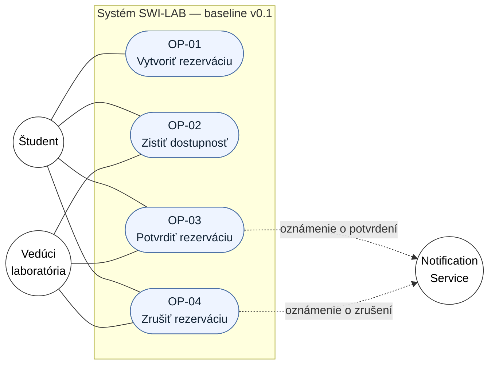
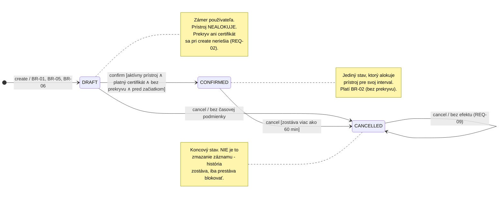
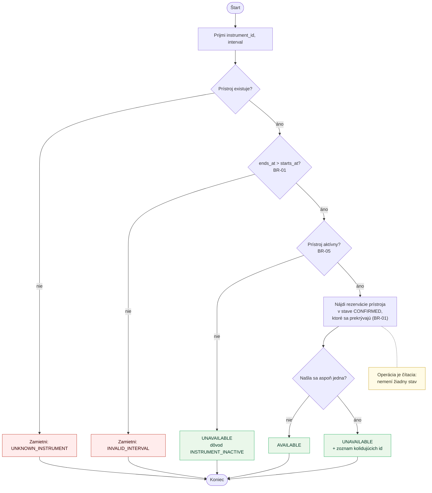
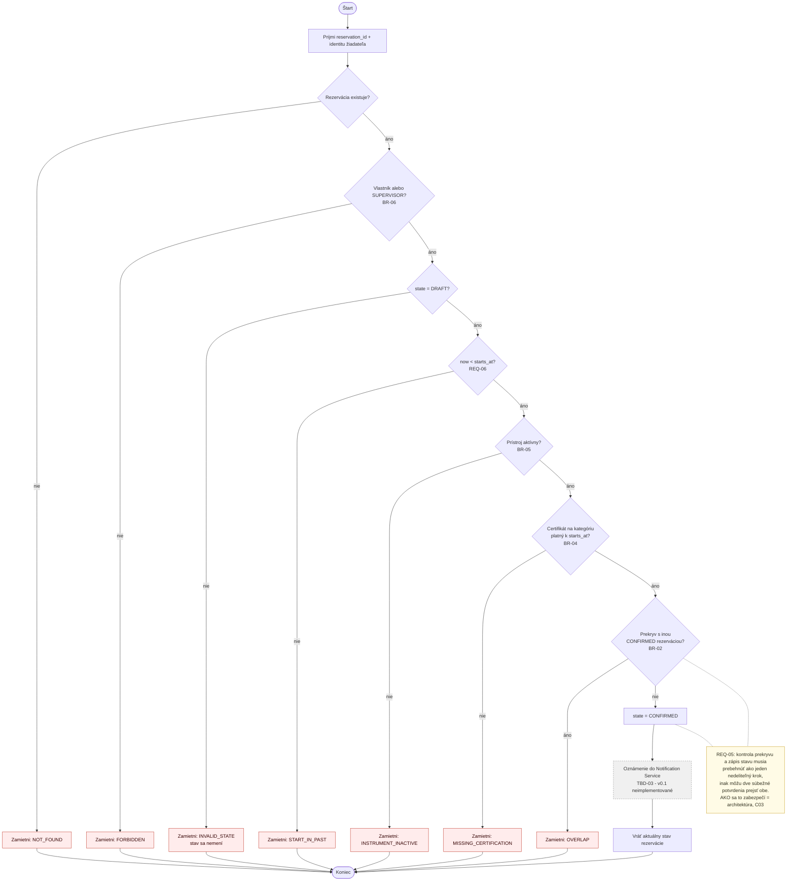
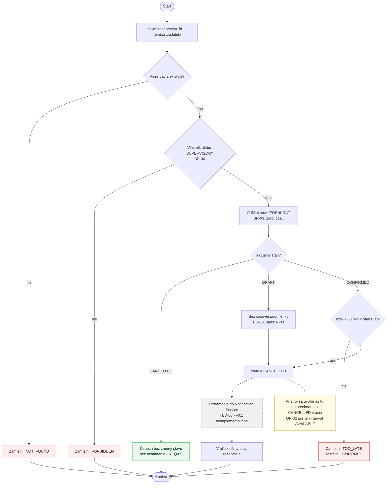

# Diagramy — Specification Baseline v0.1

Vizuálne pohľady na to isté správanie, ktoré popisuje
[docs/specification.md](specification.md). Diagramy **nedopĺňajú** nové pravidlá:
každá podmienka v nich má zodpovedajúce `BR-xx` alebo `REQ-xx` v texte. Ak sa
niekedy rozídu, rozpor sa rieši opravou oboch, nie prekreslením obrázka.

---

## 1. Diagram prípadov užitia — aktéri a ciele

Pohľad na celý minimálny systém: kto ho používa a za akým cieľom.

**Čo diagram hovorí a čo nie:**

- **Hranica systému** je obdĺžnik `SYS`. Vnútri sú iba ciele aktérov, nie
  databáza, triedy ani komponenty.
- **Študent** má všetky štyri ciele, ale podľa BR-06 vždy nad **vlastnou**
  rezerváciou.
- **Vedúci laboratória** má tie isté ciele nad **ľubovoľnou** rezerváciou
  (BR-06). Nevytvára rezervácie za iných — preto k `OP-01` nevedie čiara; ak by
  si rezervoval prístroj pre seba, vystupuje v role študenta.
- **Notification Service** je podporný externý aktér (hranica z C01). Prerušovaná
  šípka znamená, že systém ho volá, nie že ho niekto používa. V v0.1 je hranica
  **definovaná, nie implementovaná** — TBD-03.
- Žiadne `include` / `extend`. Operácie sú navzájom nezávislé ciele; `Confirm`
  síce vnútorne vyhodnocuje to isté pravidlo ako `Check Availability`, ale to je
  zdieľané **pravidlo BR-02**, nie zdieľaný prípad užitia.

---

## 2. Stavový diagram — životný cyklus Reservation

**Úplné podmienky prechodov** (skrátené v diagrame, úplné v špecifikácii):

| Prechod                 | Podmienka                                                                                                                     | Zdroj                |
| ----------------------- | ----------------------------------------------------------------------------------------------------------------------------- | -------------------- |
| `[*] → DRAFT`           | používateľ existuje ∧ prístroj existuje ∧ `is_active` ∧ `ends_at > starts_at` ∧ `now < starts_at`                              | REQ-01, BR-01/05/06  |
| `DRAFT → CONFIRMED`     | žiadateľ oprávnený ∧ `now < starts_at` ∧ prístroj `is_active` ∧ platný certifikát na kategóriu ∧ žiadny prekryv s `CONFIRMED`  | REQ-04, BR-02/04/05/06 |
| `DRAFT → CANCELLED`     | žiadateľ oprávnený — bez časovej podmienky (nález N-03)                                                                        | REQ-07, BR-03, BR-06 |
| `CONFIRMED → CANCELLED` | žiadateľ oprávnený ∧ `now + 60 min < starts_at`                                                                                | REQ-08, BR-03, BR-06 |
| `CANCELLED → CANCELLED` | žiadateľ oprávnený — bez zmeny stavu, bez oznámenia                                                                            | REQ-09               |

**Čo v diagrame zámerne nie je:**

- **Zamietnuté pokusy nie sú prechody.** Potvrdenie bez certifikátu alebo
  zrušenie 30 minút pred začiatkom nie je prechod do iného stavu — rezervácia
  zostáva tam, kde bola. Preto v diagrame nie sú slučky pre chybové prípady.
- **Stav `REJECTED` neexistuje** (rozhodnutie z C01): zamietnutie je výsledok
  pokusu o prechod, nie stav rezervácie.
- **Žiadny automatický prechod časom.** `CONFIRMED` rezervácia po skončení
  intervalu zostáva `CONFIRMED`; v0.1 nepozná stav `COMPLETED` ani plánovač,
  ktorý by ho nastavoval. Nie je to opomenutie — nič v špecifikácii také
  správanie nepotrebuje.
- Prechod `CANCELLED → CANCELLED` je v diagrame len preto, že ide
  o **pozorovateľný úspešný výsledok** (REQ-09), nie o chybu.

---

## 3. Diagramy aktivít

### 3.1 OP-01 — Create Reservation

Pri každom zamietnutí platí: **nevznikne žiadna rezervácia** a žiadny iný záznam
sa nezmení.

### 3.2 OP-02 — Check Availability

### 3.3 OP-03 — Confirm Reservation

Pri každom zamietnutí zostáva rezervácia v **pôvodnom** stave — `DRAFT` ostáva
`DRAFT`, už potvrdená ostáva `CONFIRMED`, zrušená ostáva `CANCELLED`.

### 3.4 OP-04 — Cancel Reservation

Vetva `CONFIRMED` je prísnejšia než vetva `DRAFT` — to je BR-03 a jeho
zdôvodnenie (potvrdená rezervácia blokuje prístroj ostatným, návrh nie).
